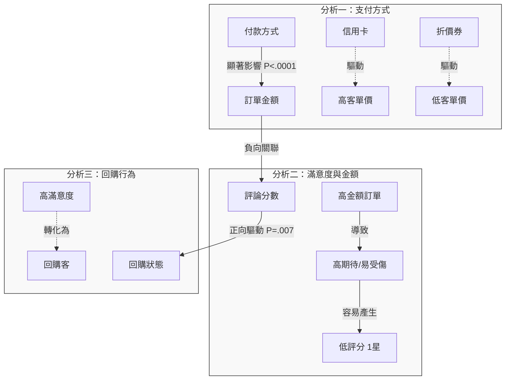
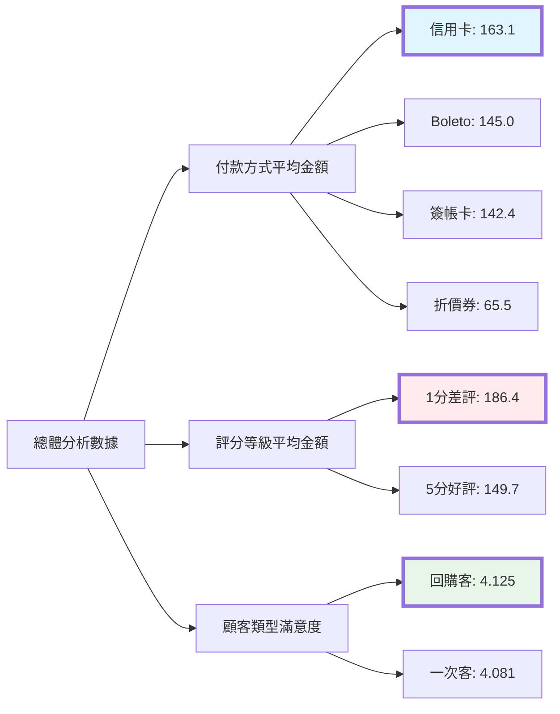

# Olist 電商資料集：消費者行為與消費金額之統計分析總結

## 1. 執行摘要
本研究利用 SAS 軟體進行統計檢定（ANOVA 與 T-test），分析 104,474 筆有效訂單資料。旨在探討付款方式、顧客滿意度與回購行為之間的關聯性。

研究發現：
1. 付款方式顯著影響客單價，信用卡為最高價值通路。
2. 訂單金額與滿意度呈負相關，高價訂單客訴風險極高。
3. 顧客滿意度顯著影響回購意願。

---

## 2. 詳細分析結果

### 分析一：付款方式與消費金額之關聯 (ANOVA)
* **檢定結果**：F(3, 104470) = 385.59, P < .0001 (顯著)
* **發現**：付款方式對消費金額有高度顯著差異。
* **數據排名 (平均客單價)**：
    1.  Credit Card (信用卡)：163.14 BRL
    2.  Boleto (銀行轉帳)：144.99 BRL
    3.  Debit Card (簽帳卡)：142.40 BRL
    4.  Voucher (折價券)：65.50 BRL
* **結論**：信用卡用戶是平台最高價值的客群，平均消費金額約為折價券用戶的 2.5 倍。

### 分析二：評論分數與消費金額之關聯 (ANOVA)
* **檢定結果**：F(4, 104469) = 82.68, P < .0001 (顯著)
* **發現**：消費金額越高，顧客給予的評分傾向越低（負向關係）。
* **數據對比**：
    * 1 分 (最差評) 平均訂單金額：186.42 BRL
    * 5 分 (最好評) 平均訂單金額：149.70 BRL
* **結論**：存在「高期待落差」現象。高單價商品伴隨著更高的服務期望，一旦發生失誤，極易產生嚴重客訴。

### 分析三：顧客類別與滿意度之關聯 (T-test)
* **檢定結果**：T statistic = 2.69, P = 0.0073 (顯著)
* **發現**：回購客的平均滿意度顯著高於一次性顧客。
* **數據對比**：
    * 回購客 (Repeat)：4.125 分
    * 一次客 (One-time)：4.081 分
* **結論**：滿意度是驅動顧客留存 (Retention) 的關鍵前置指標。

---

## 3. 策略建議
1.  **針對高價訂單建立 VIP 服務通道**：由於 180 BRL 以上的高價訂單最容易產生 1 分負評，建議針對此類訂單實施主動物流追蹤與優先客服，以降低高價值客戶流失。
2.  **優化支付行銷策略**：鑑於信用卡用戶的高消費力，應優先與銀行合作推廣分期零利率活動，而非發放低面額折價券。
3.  **滿意度挽回機制**：針對評分為 3 分或 4 分的邊緣顧客進行主動關懷，是提升回購率的最低成本方式。

---

## 4. 分析邏輯視覺化圖表

### 圖表一：變數影響關係圖 (Causal Relationship)



### 圖表二：平均消費金額與評分階層圖 (Data Hierarchy)



## 5. 程式附件

```sas
/* ============================================================ */
/* 第一步：匯入資料                    */
/* ============================================================ */

/* 路徑 */
%let path = /home/u64358597/2025-12-17/olist_data/; 

%macro import_csv(filename, dsn);
    proc import datafile="&path.&filename"
        out=&dsn
        dbms=csv
        replace;
        getnames=yes;
        guessingrows=3000;
    run;
%mend;

/* 匯入 4 張必要的表 (注意: 這裡的名稱對應到下方 SQL) */
%import_csv(olist_orders_dataset.csv, orders);
%import_csv(olist_customers_dataset.csv, customers);
%import_csv(olist_order_payments_dataset.csv, olist_order_payments_dataset);
%import_csv(olist_order_reviews_dataset.csv, olist_order_reviews_dataset);


/* ============================================================ */
/* 第二步：資料處理 (修正了 Unique ID 找不到的問題)                 */
/* ============================================================ */

proc sql;
    /* 1. 建立基礎表：合併訂單、付款、評論、顧客 */
    create table base_data as
    select 
        a.order_id,
        b.payment_type,
        b.payment_value,
        c.review_score,
        d.customer_unique_id  /* 這裡可以拿到 Unique ID 了 */
    from 
        orders as a
    /* 串接付款資訊 */
    inner join olist_order_payments_dataset as b 
        on a.order_id = b.order_id
    /* 串接評論資訊 */
    left join olist_order_reviews_dataset as c 
        on a.order_id = c.order_id
    /* 串接顧客資訊 (一定要串這張表才有 Unique ID) */
    inner join customers as d
        on a.customer_id = d.customer_id
    where 
        b.payment_type is not null 
        and b.payment_type <> 'not_defined';

    /* 2. 計算回購頻率 (修正點：同時使用 Orders 和 Customers 表來算) */
    create table freq_calc as
    select 
        d.customer_unique_id,
        count(distinct a.order_id) as freq
    from 
        orders as a
    inner join 
        customers as d on a.customer_id = d.customer_id
    group by 
        d.customer_unique_id;

    /* 3. 將頻率併回主表，產生最終分析資料 (Final Data) */
    create table final_data as
    select 
        t1.*,
        t2.freq,
        /* 標記：買超過1次就是 Repeat，否則 OneTime */
        case when t2.freq > 1 then 'Repeat ' else 'OneTime' end as Customer_Type
    from 
        base_data as t1
    left join 
        freq_calc as t2
    on t1.customer_unique_id = t2.customer_unique_id;
quit;


/* ============================================================ */
/* 第三步：統計檢定 (ANOVA & T-test)                           */
/* ============================================================ */

/* 分析 1: 付款方式 vs 消費金額 (ANOVA) */
title "分析 1: 不同付款方式的平均消費金額差異";
proc glm data=final_data;
    class payment_type;
    model payment_value = payment_type;
    means payment_type / lines;
run;

/* 分析 2: 評論分數 vs 消費金額 (ANOVA) */
title "分析 2: 評論分數與消費金額的關係";
proc glm data=final_data;
    class review_score;
    model payment_value = review_score;
    means review_score;
run;

/* 分析 3: 回購客 vs 一次客 的滿意度差異 (t-test) */
title "分析 3: 回購客與一次客的平均評分差異";
proc ttest data=final_data;
    class Customer_Type;
    var review_score;
run;
```

